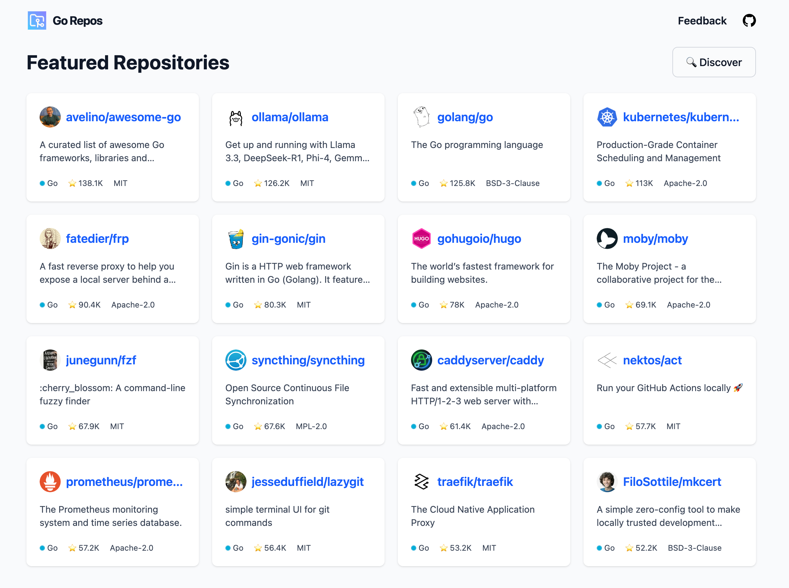

<p align="center">
    <a href="https://gorepos.glup3.dev" target="_blank" rel="noopener">
        
    </a>
</p>

# Go Repos

Showcases random GitHub Go Repositories written in Go

## Motivation

I wanted to explore Go projects and learn how to write better Go code.
Using the GitHub Search was too slow and clunky, so I built my own UI.
The data is aggregated via GitHub API and displayed via simple net/http + html/template.

> [!WARNING]
> Please keep in mind that this project is still under heavy development
> and I haven't cleaned up the code base yet.

## Development

Install Go Dependencies

```sh
go mod tidy
```

Install tailwindcss/cli

```sh
npm install
```

Run main and css watcher

```sh
make api

# in a different terminal
make css-watch
```
